# ProDialog

<p align="center">
  
</p>

<p align="center">

A beautiful, animated, highly customizable dialog framework for Flutter.

Production-ready • Zero dependencies • Material 3 • Responsive • Elegant Animations

</p>

---

## ✨ Features

- 🚀 Beautiful production-ready dialogs
- 🎨 Modern Material 3 inspired design
- 🎭 Multiple built-in dialog types
- 🌙 Dark mode support
- 📱 Responsive on phones & tablets
- 💎 Glassmorphism support
- 🌈 Gradient backgrounds
- 🎬 Smooth entry animations
- 🎯 Icon animations
- 🔘 Highly customizable buttons
- 🧩 Custom widgets support
- ⚡ Zero third-party dependencies
- ♿ Accessibility friendly
- 📦 Easy to integrate
- ❤️ Designed for production apps

---
## 📸 Preview

### Dialog Showcase

 

| 1 | 2 | 3 |
|---|---|---|
| 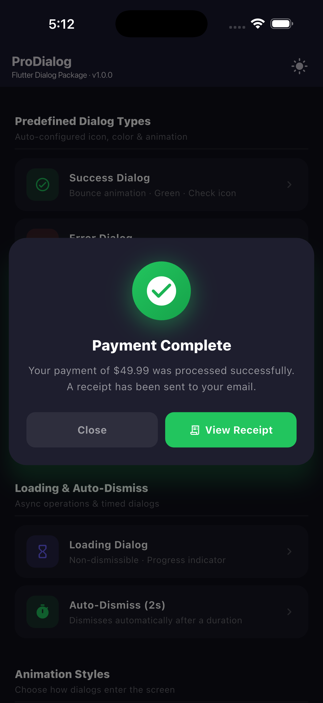 | 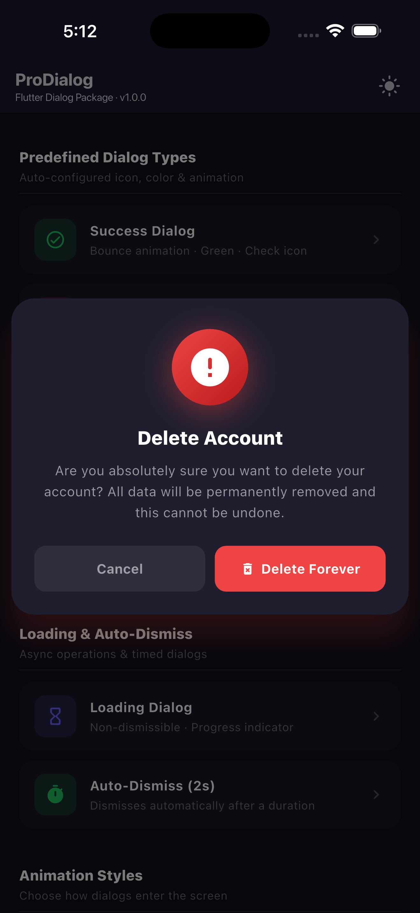 | 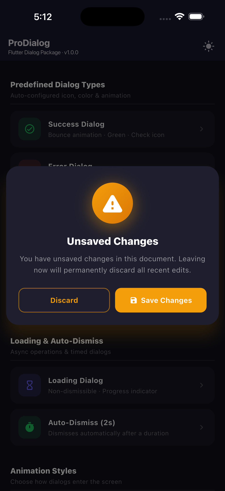 |

| 4 | 5 | 6 |
|---|---|---|
| 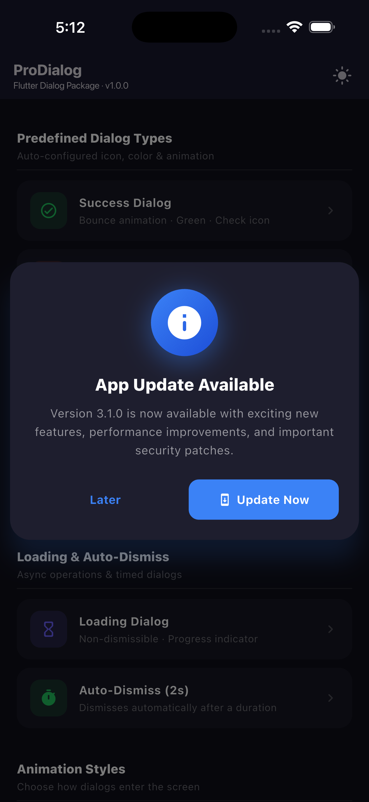 | 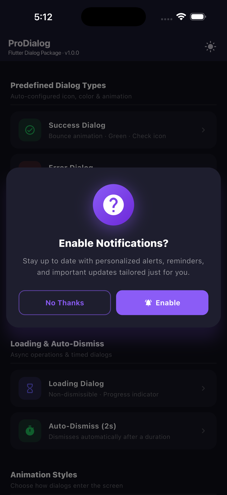 | 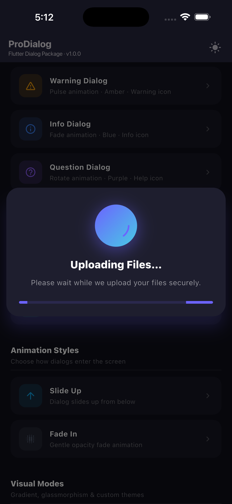 |

| 7 | 8 | 9 |
|---|---|---|
| 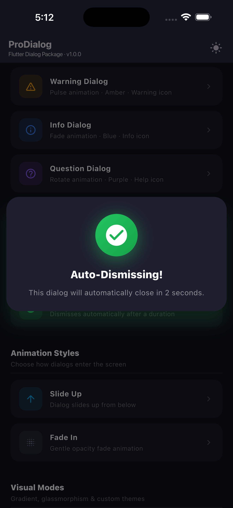 | 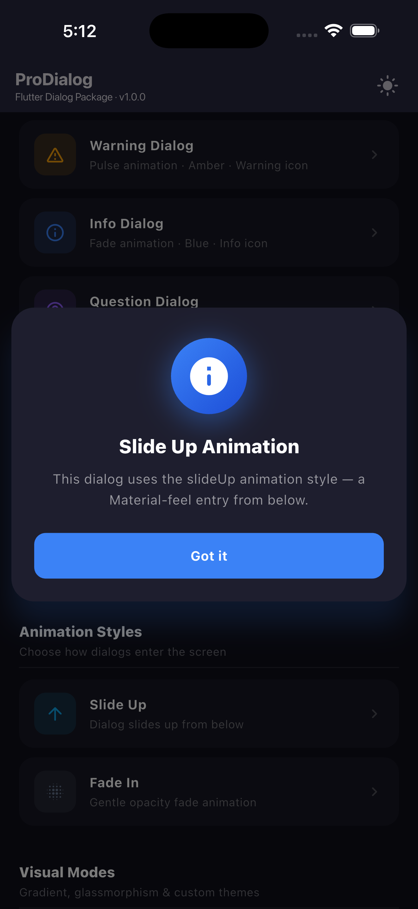 | 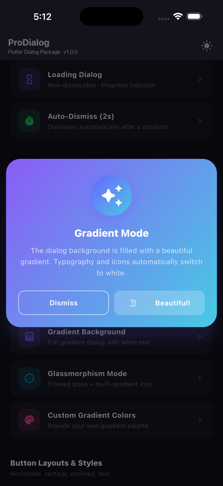 |

| 10 | 11 | 12 |
|---|---|---|
| 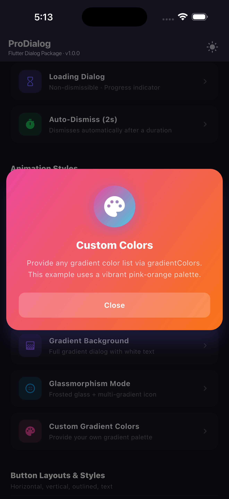 | 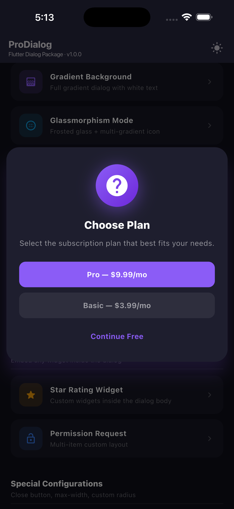 | 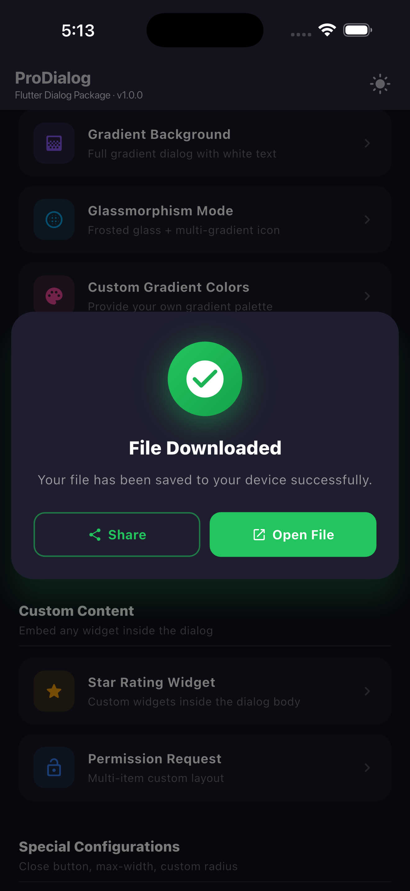 |

| 13 | 14 | 15 |
|---|---|---|
| 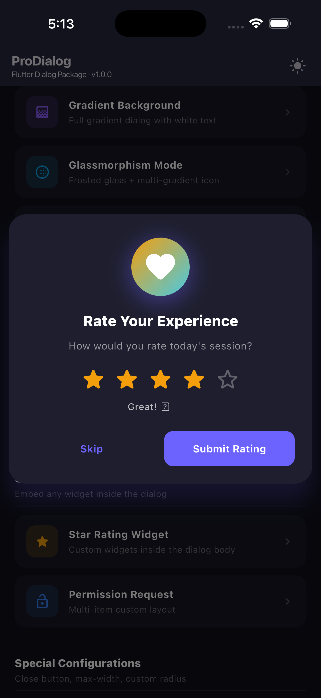 | 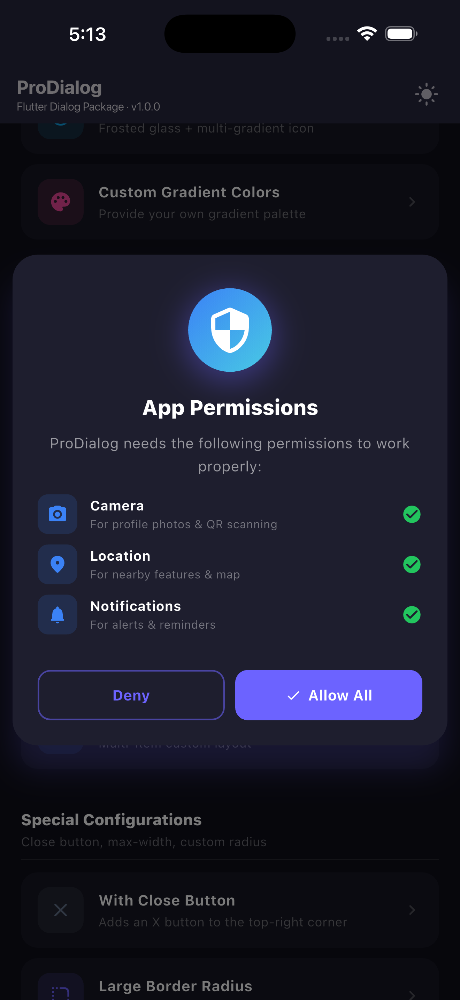 | 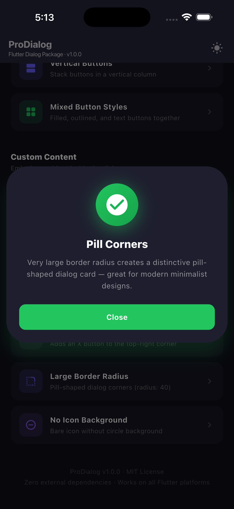 |

| 16 | 17 | 18 |
|---|---|---|
| 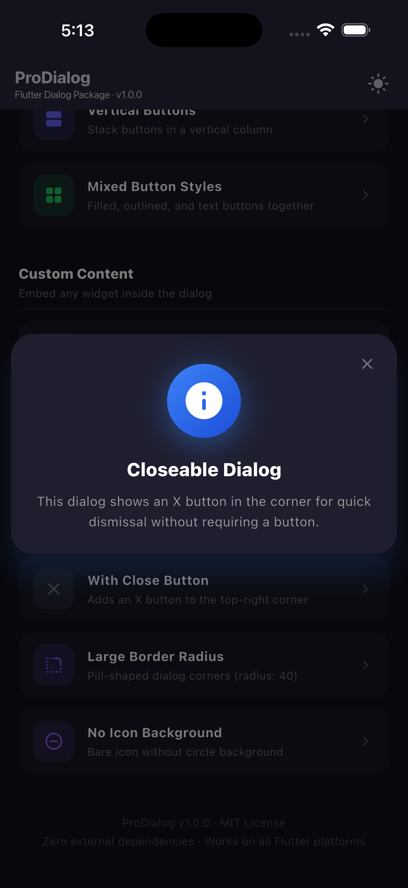 | 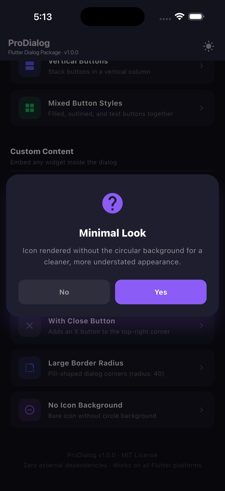 |  |

---

### Highlights

- ✅ Success Dialogs
- ❌ Error Dialogs
- ⚠️ Warning Dialogs
- ℹ️ Information Dialogs
- ❓ Question Dialogs
- ⏳ Loading Dialogs
- 🎨 Gradient Backgrounds
- 💎 Glassmorphism Effects
- 🎬 Beautiful Animations
- 🔘 Customizable Buttons
- 🌙 Dark Mode Support
- 📱 Responsive Layouts
- 🧩 Custom Content Support
- ♿ Accessibility Friendly
- 🚀 Production Ready

# Installation

Add this to your `pubspec.yaml`

```yaml
dependencies:
  pro_dialog: latest_version
```

Then run

```bash
flutter pub get
```

Import

```dart
import 'package:pro_dialog/pro_dialog.dart';
```

---

# Quick Start

```dart
showSuccessDialog(
  context,
  title: "Success",
  description: "Everything completed successfully.",
);
```

---

# Basic Dialog

```dart
showProDialog(
  context,
  type: DialogType.success,
  title: "Payment Successful",
  description: "Your payment has been confirmed.",
);
```

---

# Confirmation Dialog

```dart
showProDialog(
  context,
  type: DialogType.question,
  title: "Delete Account",
  description: "This action cannot be undone.",
  buttons: [
    DialogButton(
      text: "Cancel",
      onPressed: () => Navigator.pop(context),
    ),
    DialogButton(
      text: "Delete",
      isPrimary: true,
      onPressed: () {},
    ),
  ],
);
```

---

# Loading Dialog

```dart
showLoadingDialog(
  context,
  title: "Uploading...",
  description: "Please wait.",
);
```

---

# Dialog Types

```dart
DialogType.success
DialogType.error
DialogType.warning
DialogType.info
DialogType.question
DialogType.custom
```

---

# Available Animations

Dialog animations

```dart
DialogAnimationStyle.scale
DialogAnimationStyle.fade
DialogAnimationStyle.slideUp
DialogAnimationStyle.slideDown
DialogAnimationStyle.bounce
```

Icon animations

```dart
IconAnimationStyle.none
IconAnimationStyle.bounce
IconAnimationStyle.rotate
IconAnimationStyle.pulse
IconAnimationStyle.shake
```

---

# Custom Theme

```dart
showProDialog(
  context,
  type: DialogType.success,
  theme: ProDialogTheme(
    useGlassmorphism: true,
    borderRadius: 30,
    animationStyle: DialogAnimationStyle.bounce,
    iconAnimationStyle: IconAnimationStyle.pulse,
  ),
);
```

---

# Gradient Dialog

```dart
ProDialogTheme(
  useGradientBackground: true,
);
```

---

# Glassmorphism Dialog

```dart
ProDialogTheme(
  useGlassmorphism: true,
);
```

---

# Custom Content

```dart
showProDialog(
  context,
  customContent: Column(
    children: [
      Text("Any widget"),
      CircularProgressIndicator(),
    ],
  ),
);
```

---

# Button Styles

Filled

```dart
DialogButtonStyle.filled
```

Outlined

```dart
DialogButtonStyle.outlined
```

Text

```dart
DialogButtonStyle.text
```

---

# API Overview

## showProDialog

| Parameter | Description |
|-----------|-------------|
| type | Dialog type |
| title | Dialog title |
| description | Dialog description |
| icon | Custom icon |
| buttons | Action buttons |
| customContent | Custom widget |
| theme | Theme customization |
| autoDismissAfter | Auto close |
| barrierDismissible | Tap outside to dismiss |

---

# Built-in Helpers

```dart
showSuccessDialog()

showErrorDialog()

showWarningDialog()

showLoadingDialog()
```

---

# Responsive

Automatically adapts to

- Android
- iOS

---

# Accessibility

- Semantic labels
- Screen reader support
- High contrast
- Proper touch targets

---

# Example Project

A complete example application is available inside

```
example/
```

Run it

```bash
cd example
flutter run
```

---

# Roadmap

- [ ] Cupertino dialogs
- [ ] Bottom Sheet support
- [ ] Blur animations
- [ ] Hero transitions
- [ ] Preset themes
- [ ] Localization

---

# Contributing

Contributions are welcome!

1. Fork the repository
2. Create a feature branch
3. Commit your changes
4. Open a Pull Request

---

# Issues

If you find a bug or have a feature request, please open an issue on GitHub.

---

# License

MIT License

Copyright (c) 2026 Amir Bayat

---

## ⭐ Support

If you like this package,

⭐ Star the repository on GitHub

👍 Like the package on pub.dev

❤️ Share it with other Flutter developers
